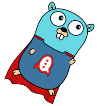

# Gocket Chat

[](https://pkg.go.dev/github.com/PandatiX/gocket-chat)
[](https://goreportcard.com/report/github.com/PandatiX/gocket-chat)
[](https://codecov.io/gh/PandatiX/gocket-chat)
[](https://hub.docker.com/r/pandatix/gocket-chat/)
[](https://github.com/PandatiX/gocket-chat/actions?query=workflow%3Aci+)



Gocket Chat (pronunced `/goket chat/`) provides a convenient Go RocketChat API.
It comes with tools such as a Drone plugin that sends messages about your pipeline status.

List of available tools:
 - [RocketChat API](#api) ;
 - [Drone plugin](#drone-plugin) to send messages from your pipelines.

## API

Gocket Chat provides a convenient Go RocketChat API.
Package is under active development. Not stable.

API is built upon the official documentation, and the responses from manual reverse since it's not properly documented.

This can be used to pentest your own RocketChat instance, and in case you find a vulnerability, refers to [SECURITY.md](https://github.com/PandatiX/gocket-chat/blob/master/SECURITY.md).

### How to use

To use the API, import the RocketChat API group (i.e. `chat`), create a `RocketClient` and provide the parameters to your API callx.

In instance, the following sends a message to the channel `#general`.

```golang
package main

import (
	"log"
	"net/http"

	gochat "github.com/PandatiX/gocket-chat"
	"github.com/PandatiX/gocket-chat/api/chat"
)

func str(str string) *string {
	return &str
}

func main() {
	// Create the http.Client to use.
	client := &http.Client{}

	// Create your RocketClient for API calls.
	rc, err := gochat.NewRocketClient(client, "http://myrocketchat.com", "my_token", "my_user_id")
	if err != nil {
		log.Fatal(err)
	}

	// Set up the /api/v1/chat.postMessage parameters.
	pmp := chat.PostMessageParams{
		Channel: "#general",
		Text:    str("What a beautiful text !"),
		Alias:   str("🤖 RocketBot 🤖"),
	}

	// Issue a call to the /api/v1/chat.postMessage endpoint.
	res, err := chat.PostMessage(rc, pmp)
	if err != nil {
		log.Fatal(err)
	}
}
```

## Drone plugin

Drone plugin, aka `pandatix/gocket-chat`, is a [Drone CI](https://drone.io) plugin that sends messages to a RocketChat server.
It enables you to get a feedback of your pipeline without having to wait for it to complete.

### Parameter Reference

| Value | Description |
|---|---|
| `url` | RocketChat server URL. |
| `user_id` | RocketChat user's ID. |
| `token` | RocketChat token. |
| `channel` | RocketChat channel (or user ID). |
| `message` | RocketChat message. Takes a Go template, see Drone variables accessible in other flags. |
| `alias ` | RocketChat alias to post the message with. |
| `avatar_url` | RocketChat avatar URL to post the message with. |

### Configuration

The following give you a step configuration example with a custom message template and using credentials from secrets.

```yaml
- name: rocket-feedback
  image: pandatix/gocket-chat:latest
  settings:
    url:
      from_secret: rocket_url
    user_id:
      from_secret: rocket_user
    token:
      from_secret: rocket_token
    channel:
      from_secret: rocket_channel
    message: |
      {{- if eq .Drone.Build.Status "success" }}
        build {{ .Drone.Build.Number }} succeeded. Good job.
      {{- else }}
        build {{ .Drone.Build.Number }} failed. Fix me please.
      {{- end }}
```

### Template (and function) Reference

As the plugin uses the Go `text/template` package for parsing the `message`, you are able to use [all references from the package](https://pkg.go.dev/text/template).

You can also use the following Drone environment variables (see [official Drone documentation](https://docs.drone.io/pipeline/environment/reference/) for the meaning of each).

| Environment variable         | Template variable                     | CLI flag                 |
|------------------------------|---------------------------------------|--------------------------|
| `CI`                         | `{{ .CI }}`                           | `--ci`                   |
| `DRONE`                      | `{{ .Drone.Status }}`                 | `--drone`                |
| `DRONE_BRANCH`               | `{{ .Drone.Branch }}`                 | `--drone.branch`         |
| `DRONE_BUILD_ACTION`         | `{{ .Drone.Build.Action }}`           | `--build.action`         |
| `DRONE_BUILD_CREATED`        | `{{ .Drone.Build.Created }}`          | `--build.created`        |
| `DRONE_BUILD_EVENT`          | `{{ .Drone.Build.Event }}`            | `--build.event`          |
| `DRONE_BUILD_FINISHED`       | `{{ .Drone.Build.Finished }}`         | `--build.finished`       |
| `DRONE_BUILD_NUMBER`         | `{{ .Drone.Build.Number }}`           | `--build.number`         |
| `DRONE_BUILD_PARENT`         | `{{ .Drone.Build.Parent }}`           | `--build.parent`         |
| `DRONE_BUILD_STARTED`        | `{{ .Drone.Build.Started }}`          | `--build.started`        |
| `DRONE_BUILD_STATUS`         | `{{ .Drone.Build.Status }}`           | `--build.status`         |
| `DRONE_CALVER`               | `{{ .Drone.Calver }}`                 | `--calver`               |
| `DRONE_COMMIT`               | (Use `{{ .Drone.Commit.SHA }}`)       | (Use `--commit.sha`)     |
| `DRONE_COMMIT_AFTER`         | `{{ .Drone.Commit.After }}`           | `--commit.after`         |
| `DRONE_COMMIT_AUTHOR`        | `{{ .Drone.Commit.Author.Username }}` | `--commit.author`        |
| `DRONE_COMMIT_AUTHOR_AVATAR` | `{{ .Drone.Commit.Author.Avatar }}`   | `--commit.author.avatar` |
| `DRONE_COMMIT_AUTHOR_EMAIL`  | `{{ .Drone.Commit.Author.Email }}`    | `--commit.author.email`  |
| `DRONE_COMMIT_AUTHOR_NAME`   | `{{ .Drone.Commit.Author.Name }}`     | `--commit.author.name`   |
| `DRONE_COMMIT_BEFORE`        | `{{ .Drone.Commit.Before }}`          | `--commit.before`        |
| `DRONE_COMMIT_BRANCH`        | `{{ .Drone.Commit.Branch }}`          | `--commit.branch`        |
| `DRONE_COMMIT_LINK`          | `{{ .Drone.Commit.Link }}`            | `--commit.link`          |
| `DRONE_COMMIT_MESSAGE`       | `{{ .Drone.Commit.Message }}`         | `--commit.message`       |
| `DRONE_COMMIT_REF`           | `{{ .Drone.Commit.Ref }}`             | `--commit.ref`           |
| `DRONE_COMMIT_SHA`           | `{{ .Drone.Commit.SHA }}`             | `--commit.sha`           |
| `DRONE_DEPLOY_TO`            | `{{ .Drone.DeployTo }}`               | `--deploy-to`            |
| `DRONE_FAILED_STAGES`        | `{{ .Drone.Failed.Stages }}`          | `--failed.stages`        |
| `DRONE_FAILED_STEPS`         | `{{ .Drone.Failed.Steps }}`           | `--failed.steps`         |
| `DRONE_GIT_HTTP_URL`         | `{{ .Drone.Git.HTTPURL }}`            | `--git.http-url`         |
| `DRONE_GIT_SSH_URL`          | `{{ .Drone.Git.SSHURL }}`             | `--git.ssh-url`          |
| `DRONE_PULL_REQUEST`         | `{{ .Drone.PullRequest }}`            | `--pull-request`         |
| `DRONE_REMOTE_URL`           | `{{ .Drone.RemoteURL }}`              | `--remote-url`           |
| `DRONE_REPO`                 | `{{ .Drone.Repo.Fullname }}`          | `--repo`                 |
| `DRONE_REPO_BRANCH`          | `{{ .Drone.Repo.Branch }}`            | `--repo.branch`          |
| `DRONE_REPO_LINK`            | `{{ .Drone.Repo.Link }}`              | `--repo.link`            |
| `DRONE_REPO_NAME`            | `{{ .Drone.Repo.Name }}`              | `--repo.name`            |
| `DRONE_REPO_NAMESPACE`       | `{{ .Drone.Repo.Namespace }}`         | `--repo.namespace`       |
| `DRONE_REPO_OWNER`           | `{{ .Drone.Repo.Owner }}`             | `--repo.owner`           |
| `DRONE_REPO_PRIVATE`         | `{{ .Drone.Repo.Private }}`           | `--repo.private`         |
| `DRONE_REPO_SCM`             | `{{ .Drone.Repo.SCM }}`               | `--repo.scm`             |
| `DRONE_REPO_VISIBILITY`      | `{{ .Drone.Repo.visibility }}`        | `--repo.visibility`      |
| `DRONE_SEMVER`               | `{{ .Drone.Semver.Full }}`            | `--semver`               |
| `DRONE_SEMVER_BUILD`         | `{{ .Drone.Semver.Build }}`           | `--semver.build`         |
| `DRONE_SEMVER_ERROR`         | `{{ .Drone.Semver.Error }}`           | `--semver.error`         |
| `DRONE_SEMVER_MAJOR`         | `{{ .Drone.Semver.Major }}`           | `--semver.major`         |
| `DRONE_SEMVER_MINOR`         | `{{ .Drone.Semver.Minor }}`           | `--semver.minor`         |
| `DRONE_SEMVER_PATCH`         | `{{ .Drone.Semver.Patch }}`           | `--semver.patch`         |
| `DRONE_SEMVER_PRERELEASE`    | `{{ .Drone.Semver.Prerelease }}`      | `--semver.prerelease`    |
| `DRONE_SEMVER_SHORT`         | `{{ .Drone.Semver.Short }}`           | `--semver.short`         |
| `DRONE_SOURCE_BRANCH`        | `{{ .Drone.SourceBranch }}`           | `--source-branch`        |
| `DRONE_STAGE_ARCH`           | `{{ .Drone.Stage.Arch }}`             | `--stage.arch`           |
| `DRONE_STAGE_DEPENDS_ON`     | `{{ .Drone.Stage.DependsOn }}`        | `--stage.depends-on`     |
| `DRONE_STAGE_FINISHED`       | `{{ .Drone.Stage.Finished }}`         | `--stage.finished`       |
| `DRONE_STAGE_KIND`           | `{{ .Drone.Stage.Kind }}`             | `--stage.kind`           |
| `DRONE_STAGE_MACHINE`        | `{{ .Drone.Stage.Machine }}`          | `--stage.machine`        |
| `DRONE_STAGE_NAME`           | `{{ .Drone.Stage.Name }}`             | `--stage.name`           |
| `DRONE_STAGE_NUMBER`         | `{{ .Drone.Stage.Number }}`           | `--stage.number`         |
| `DRONE_STAGE_OS`             | `{{ .Drone.Stage.OS }}`               | `--stage.os`             |
| `DRONE_STAGE_STARTED`        | `{{ .Drone.Stage.Started }}`          | `--stage.started`        |
| `DRONE_STAGE_STATUS`         | `{{ .Drone.Stage.Status }}`           | `--stage.status`         |
| `DRONE_STAGE_TYPE`           | `{{ .Drone.Stage.Type }}`             | `--stage.type`           |
| `DRONE_STAGE_VARIANT`        | `{{ .Drone.Stage.Variant }}`          | `--stage.variant`        |
| `DRONE_STEP_NAME`            | `{{ .Drone.Step.Name }}`              | `--step.name`            |
| `DRONE_STEP_NUMBER`          | `{{ .Drone.Step.Number }}`            | `--step.number`          |
| `DRONE_SYSTEM_HOST`          | `{{ .Drone.System.Host }}`            | `--system.host`          |
| `DRONE_SYSTEM_HOSTNAME`      | `{{ .Drone.System.Hostname }}`        | `--system.hostname`      |
| `DRONE_SYSTEM_PROTO`         | `{{ .Drone.System.Proto }}`           | `--system.proto`         |
| `DRONE_SYSTEM_VERSION`       | `{{ .Drone.System.Version }}`         | `--system.version`       |
| `DRONE_TAG`                  | `{{ .Drone.Tag }}`                    | `--tag`                  |
| `DRONE_TARGET_BRANCH`        | `{{ .Drone.TargetBranch }}`           | `--target-branch`        |
